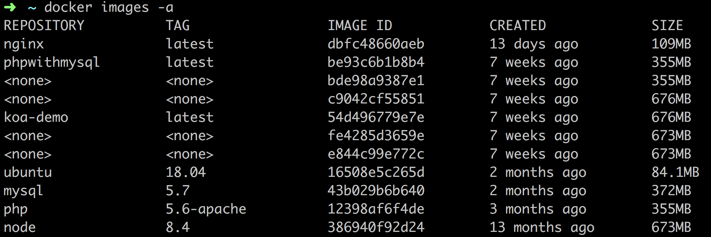
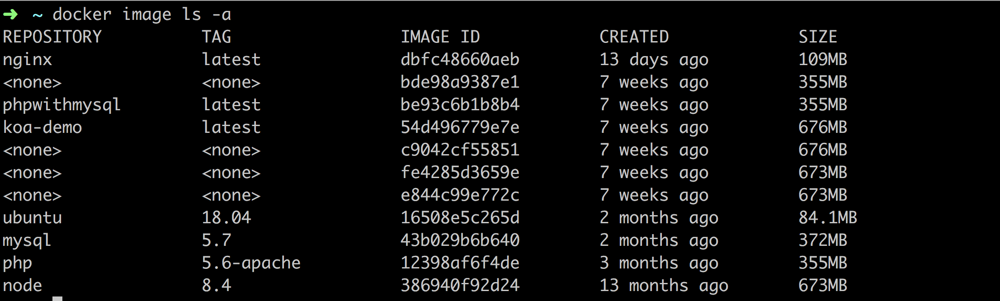
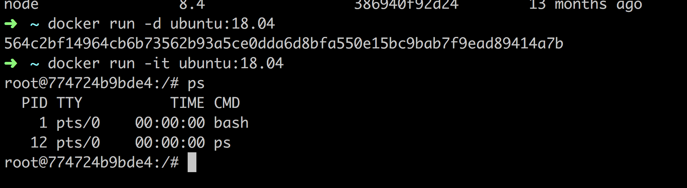

## 基本概念

Dokcer包括3个基本概念

<!-- more -->

```
镜像（Image）

容器（Container）

仓库（Repository）
```

#### Docker镜像(Image)

Decker镜像是一个特殊的文件系统，提供容器运行时所需的仓库、资源、配置等文件以及容器运行所需参数。

```
 镜像是分层的。每一层叫做一个镜像层，使用docker  history imageid查看

 镜像是有依赖关系的。上层的镜像依赖下层的镜像，这样设计的好处是，镜像可以复用

 镜像是只读的。下层的镜像层不会被修改，只能新增镜像层，所以会越来越多
```

```
获取镜像的几种方式

1、从仓库获取docker  pull

2、Dcokerfile构建 docker build

3、文件载入 docker load
```

#### Docker容器(Container)

容器是基于镜像来运行的。docker run 命令使用image启动了一个运行中的系统，就是container（容器）。

```
可读写的

在容器里面进行的操作不会影响image，删除文件也只是在容器里面标记为已删除

容器删除，则保存在容器中的数据也会被删除，容器停止，数据不会被删除

容器只有被保存成镜像才能被移植到其他地方
```

#### Docker仓库(Repository)

```
 Dokcker的仓库和git仓库差不多，拥有tag，仓库名。在本地构建完镜像以后，就可以通过仓库分发
```
 
[官方仓库](https://hub.docker.com/)、[阿里云](https://dev.aliyun.com/search.html)

## 安装(macOS)

#### 系统要求

```
Docker for Mac 要求系统最低为 macOS 10.10.3 Yosemite。如果系统不满足需求，可以安装 Docker Toolbox。
```
[Docker Toolbox安装地址](https://docs.docker.com/toolbox/overview/)

#### Homebrew安装

```
brew cask install docker
```
#### 手动安装

点击下载[Stable](https://download.docker.com/mac/stable/Docker.dmg)或者[Edge](https://download.docker.com/mac/edge/Docker.dmg)版本for mac

安装完成后在启动台找到类似**小鲸鱼**的图标，双击运行

#### 国内镜像加速

```
点击任务栏 => Perferences => Deamon => Registry mirrors => 添加https://registry.docker-cn.com => 点击Apply & Restart
```

等待docker重启完毕，检查是否配置成功

```
docker info

如果看到：

Registry Mirrors:

 https://registry.docker-cn.com/
```
说明配置成功

## 使用镜像

#### 获取镜像

从 Docker 镜像仓库获取镜像的命令是 docker pull

可在控制台通过**docker pull--help**查看

```
docker pull [选项] [Docker Registry 地址[:端口号]/]仓库名[:标签]

Docker 镜像仓库地址：地址的格式一般是 <域名/IP>[:端口号]。默认地址是 Docker Hub

仓库名：如之前所说，这里的仓库名是两段式名称，即 <用户名>/<软件名>。

对于 Docker Hub，如果不给出用户名，则默认为 library，也就是官方镜像。
```

#### 列出镜像

查看所拥有的镜像

```
docker images 或者 docker image ls
```

```
REPOSITORY         TAG                 IMAGE ID            CREATED             SIZE
nginx               latest              dbfc48660aeb        12 days ago         109MB
phpwithmysql        latest              be93c6b1b8b4        7 weeks ago         355MB
koa-demo            latest              54d496779e7e        7 weeks ago         676MB
ubuntu              18.04               16508e5c265d        2 months ago        84.1MB
mysql               5.7                 43b029b6b640        2 months ago        372MB
php                 5.6-apache          12398af6f4de        3 months ago        355MB
node                8.4                 386940f92d24        13 months ago       673MB
```
| name | description |
| :-: | :-: |
| REPOSITORY | 仓库名 |
| TAG | 标签 |
| IMAGE ID | 镜像 ID |
| CREATED | 创建时间 |
| SIZE | 占用空间 |

#### 镜像体积

查看镜像、容器、数据卷所占用空间
```
docker system df
```
#### 虚悬镜像



如图上面的<none>镜像

```
原本是有名称的，当官方更新镜像版本之后，使用docker pull时，镜像名称被转移
到新镜像身上，旧的镜像名称就成了none，docker build也会出现此类情况。由于
新旧镜像同名，就镜像名称名称被取消成为none，称之为虚悬镜像。

// 查看虚悬镜像

docker image ls -f dangling=true
```

删除虚悬镜像

```
docker image prune
```

#### 中间层镜像

为了加速镜像构建、重复利用资源，Docker 会利用 中间层镜像。所以在使用一段时间后，可能会看到一些依赖的中间层镜像。默认的 docker image ls 列表中只会显示顶层镜像，如果希望显示包括中间层镜像在内的所有镜像的话，需要加 -a 参数。

```
docker image ls -a
```



这里面的虚悬镜像很多是中间层镜像，不要删除。

#### 删除镜像

```
docker image rm [options] <name1> [<name2> ...]
```

name可以是镜像ID、镜像名称、镜像摘要

更精确的是使用**镜像摘要**删除镜像

```
docker image ls --digests


REPOSITORY          TAG                 DIGEST                                                                    IMAGE ID            CREATED             SIZE
nginx               latest              sha256:b73f527d86e3461fd652f62cf47e7b375196063bbbd503e853af5be16597cb2e   dbfc48660aeb        13 days ago         109MB

docker image rm sha256:b73f527d86e3461fd652f62cf47e7b375196063bbbd503e853af5be16597cb2e
```

## 容器

#### 启动容器

两种方式：

1、基于镜像新建容器启动

2、重启终止状态的容器

##### 新建并启动 docker run
```
-d              守护状态运行
-it             交互状态行运行
--name          my_nginx 容器的别名
--link          web/www 通过别名访问	
-e              MY_ENV=hello 添加环境变量
-p              8080:80 端口映射
--entrypoint    容器起来首先执行的命令
-v              挂载点
--network       指定网络
	 bridge、host、overlay
--ip            指定容器ip
```



获取容器的输出信息，可以通过 docker container logs

##### 启动已终止容器 docker container start

```
通过docker container start --help查看

docker container start [OPTIONS] CONTAINER [CONTAINER...]
```

查看运行中的容器：

```
docker ps 或者 docker container ls
```

##### 终止容器

```
通过docker container stop --help查看

docker container stop [OPTIONS] CONTAINER [CONTAINER...]
```

##### 重启

```
通过docker container restart --help查看

docker container restart [OPTIONS] CONTAINER [CONTAINER...]
```

终止状态的容器可以用 **docker container ls -a** 命令看到

#### 进入容器

进入运行中的容器： 
```
详细输入docker exec --help查看

docker exec -it ID bash
```

#### 导出、导入容器

导出容器
```
docker export [OPTIONS] CONTAINER
```

导入容器

```
docker import [OPTIONS] file|URL|- [REPOSITORY[:TAG]]
```

#### 删除容器

```
docker ps  或者 docker container ls  获取所有运行中的容器

docker ps -a 或者 docker container ls -a 获取本机所有容器

docker container rm ID(容器ID)

如果要删除一个运行中的容器，可以添加 -f 参数

清理所有处于终止状态的容器

docker container prune
```