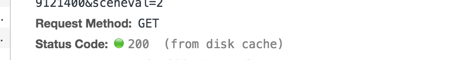
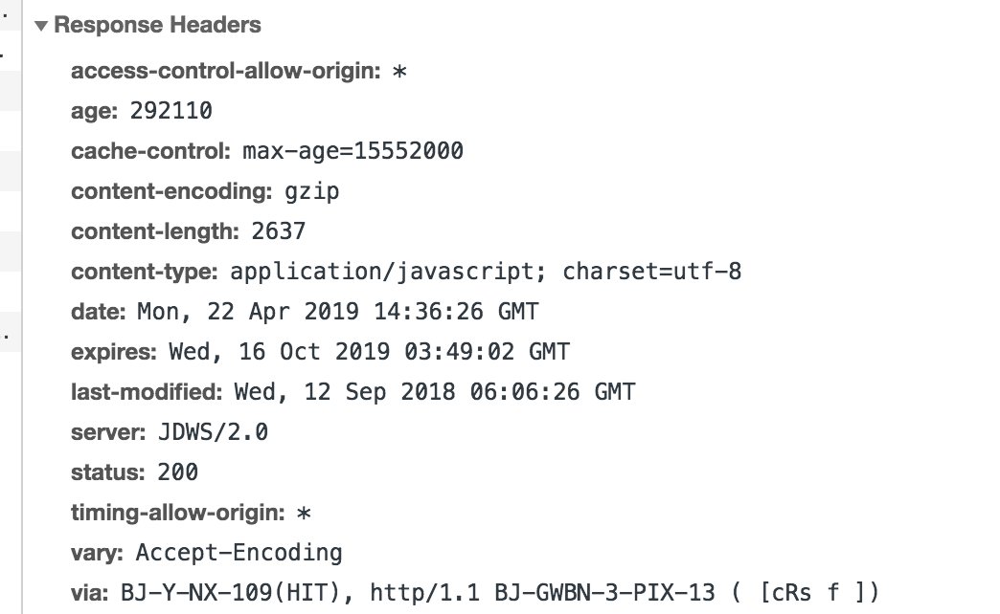

## 缓存作用

- 可以减少不必要的数据传输
- 可以提高访问速度
- 可以减少服务器的负担， 提高网站性能

<!-- more -->

## 分类

缓存主要分为`强缓存`和`协商缓存` 

`强缓存`的优先级比较高，如果命中强制缓存，那么客户端就不用再和服务器发生交互，如果没有命中强制缓存，才会走协商缓存。协商缓存不管是否命中，都需要与服务端发生交互。

### 强缓存

强缓存是否命中是根据http头中的`Expires`和`Cache-Control`两个字段来控制的，当请求发出时，浏览器会根据`expires`和`cache-control`判断请求资源是否命中强缓存，如果命中，就无须再向服务器交互，直接从缓存中获取资源。

**命中强缓存的情况下，返回的HTTP状态码为200**

如下图：

#### Expires

Expires是http1.0的产物，服务器返回的响应头中包含expires字段，表明了缓存的过期时间，等到我们再次向服务端发请求时，浏览器就会将本地时间和expires字段返回的时间进行对比，如果本地时间小于expires字段的时间，那么就会直接从缓存中读取数据，不再与服务器交互。

如下图，可以清晰看到返回的expires字段，表明了一个过期时间戳

Expires存在一个很明显的弊端，那就是完全是依赖`时间戳`来比较过期时间，如果我们故意修改本地时间，或者服务端和客户端的时间设置不一样的情况下，expires将无法达到预期作用。

