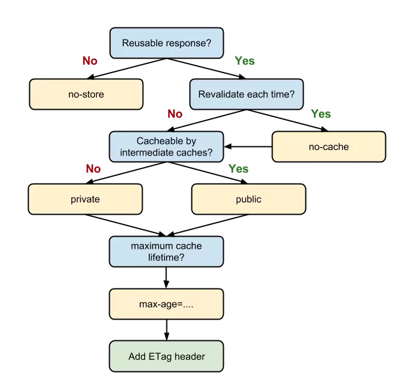

## 缓存作用

- 可以减少不必要的数据传输
- 可以提高访问速度
- 可以减少服务器的负担， 提高网站性能

<!-- more -->

## 分类

缓存主要分为`强缓存`和`协商缓存` 

`强缓存`的优先级比较高，如果命中强缓存，那么客户端就不用再和服务器发生交互，如果没有命中强缓存，才会走协商缓存。协商缓存不管是否命中，都需要与服务端发生交互。

### 强缓存

强缓存是否命中是根据http头中的`Expires`和`Cache-Control`两个字段来控制的，当请求发出时，浏览器会根据`expires`和`cache-control`判断请求资源是否命中强缓存，如果命中，就无须再向服务器交互，直接从缓存中获取资源。

**命中强缓存的情况下，返回的HTTP状态码为200**

如下图：


#### Expires

Expires是HTTP/1.0的产物，服务器返回的响应头中包含expires字段，表明了缓存的过期时间，等到我们再次向服务端发请求时，浏览器就会将本地时间和expires字段返回的时间进行对比，如果本地时间小于expires字段的时间，那么就会直接从缓存中读取数据，不再与服务器交互。

如下图，可以清晰看到返回的expires字段，表明了一个过期时间戳


Expires存在一个很明显的弊端，那就是过于依赖`时间戳`来比较过期时间，如果我们故意修改本地时间，或者服务端和客户端的时间设置不一样的情况下，expires将无法达到预期作用。

#### Cache-Control

因为expires的不完美，所以HTTP/1.1增加了Cache-Control这个字段

**`Cache-Control`的优先级高于`Expires`,如果响应头中两个字段都出现了，那么以`Cache-Control`为准**

Cache-Control的value值

##### max-age和s-maxage

还是看看这张图


```
cache-control: 15552000
```
可以看到`max-age`并不是一个时间戳，而是一个时间长度，也就是说，在这个时间段(15552000秒)内，缓存都是生效的。比起expires通过时间戳来对比的缺陷，更加精确

`s-maxage`优先级高于`max-age`，两者同时出现时，优先考虑`s-maxage`，但是`s-maxage`只有在`代理服务器`中生效，客户端中只考虑`max-age`。

##### public和private

`public` 表示客户端和代理服务器都可以缓存
`private`表示只能浏览器缓存，代理服务器不允许缓存

##### no-store和no-cache

`no-cache`: 表示每次请求资源都直接向服务器确认缓存时候过期，而不是比较浏览器缓存是否过期(和协商缓存的作用一样了)
`no-store`: 表示完全不走缓存，不管是客户端还是服务端的缓存都不会询问，每次请求直接向服务器请求数据。


### 协商缓存

#### Last-Modified

`Last-Modified`也是一个时间戳，如果命中了`协商缓存`，第一次请求返回的响应头中会带有有`Last-Modified`，表示请求资源最后修改的时间，而在下一次在次请求时，在请求头中会带上`If-Modified-Since`字段，该字段就是第一次请求资源服务端返回的请求头中的`Last-Midified`字段的值。

服务端接收到客户端发送的`If-Modified-Since`的值之后，会和服务端请求资源的最后修改时间对比
- 如果不一样，就会返回给客户端一个完整的响应，并且响应头返回`Last-Modified`字段
- 如果一样，那么就返回304状态码，响应头不会返回`Last-Modified`字段

**存在的问题/弊端：**

- 某些服务器不能精确得到文件的最后修改时间， 这样就无法通过最后修改时间来判断文件是否更新了
- Last-Modified只能精确到秒,但是如果修改文件速度过快，比如在50ms就完成修改，那就监测不到资源的变更了
- 如果文件的最后修改时间改变了，但是内容并未改变(比如修改了文件的名字)。我们也不希望客户端认为这个文件被修改过。

#### Etag

`Etag`的出现是作为`Last-Modified`的补充，`Etag`是根据实体内容生成的一段hash字符串,可以标识资源的状态,只有文件内容改变了，Etag才会发生变化。

`Etag`在感知文件变化比`Last-Modified`更加准确，而且`Etag 的优先级比 Last-Modified 更高`，两者都存在时，以`Etag`为准

如果命中了`协商缓存`，客户端第一次访问资源时，在响应头中会包含`Etag`字段，而当客户端再次请求资源时，会在请求头中写入`If-None-Match`字段，服务端接受到`If-None-Match`字段后，会和请求资源的`Etag`对比

- 如果相同，则代表资源未修改，相应304
- 如果不相同，返回完整资源，并且响应头返回新的`Etag`字段

### HTTP缓存策略图


