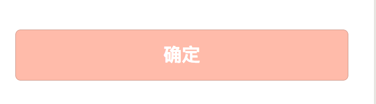
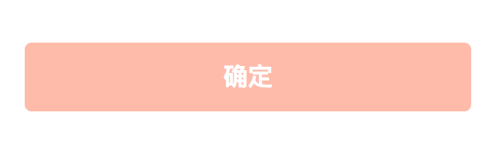
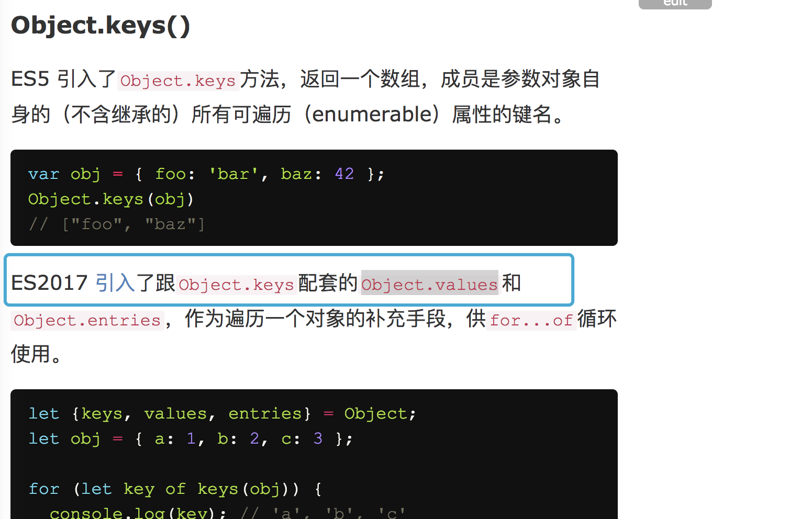

小程序开发中的问题

<!-- more -->
### button边框描边问题

小程序中的button自带了边框描边，在开发过程中设置

```

button {
  border: none;
}

```
无效果，后经过查资料发现，小程序的button不能通过这样设置

解决方法: 使用伪元素

```

button::after {
  border: none;
}

```

有描边



无描边




### Component里面的iconfont

如果在写公共组件中有iconfont字体，在组件内部设置icon的class是无效的


```
  //例如custom-component组件内

  <view class="icon-xxx"></view>

  // 直接这样写是没有效果的

```

解决方法

小程序的componnt可以给组件内部传class

通过externalClasses传进组件内部


组件内部

```
  // 例如custom-component的view

  <view class="icon-class"></view>

  //js

  Component({
    externalClasses: ['icon-class']
  })

```

调用组件的地方

```
  //xxxx就可以使用icon-xxx，这样就能使iconfont生效了

  <custom-component icon-class="xxxx"></custom-component>

```

详见[这里](https://developers.weixin.qq.com/miniprogram/dev/framework/custom-component/wxml-wxss.html)

### 部分手机不支持Object.values

在小程序代码中使用了Object.values这个方法，但是调试过程中，发现在iOS 10.2版本的手机上报错，Object.values is not a function

自行Google后发现有同样人出现了这个问题，官方回复是现在还只支持目前支持的是 es6 转 es5。

从[阮老师的博客](http://es6.ruanyifeng.com/#docs/object#Object-keys%EF%BC%8CObject-values%EF%BC%8CObject-entries)中了解到Object.values是ES2017引入的



参考链接

1.[这里](https://developers.weixin.qq.com/community/develop/doc/000a8cc2f307f0f5c5c6b14ca5b400)

2.[这里](https://developers.weixin.qq.com/miniprogram/dev/devtools/details.html#%E5%AE%A2%E6%88%B7%E7%AB%AFes6-api-%E6%94%AF%E6%8C%81%E6%83%85%E5%86%B5)
