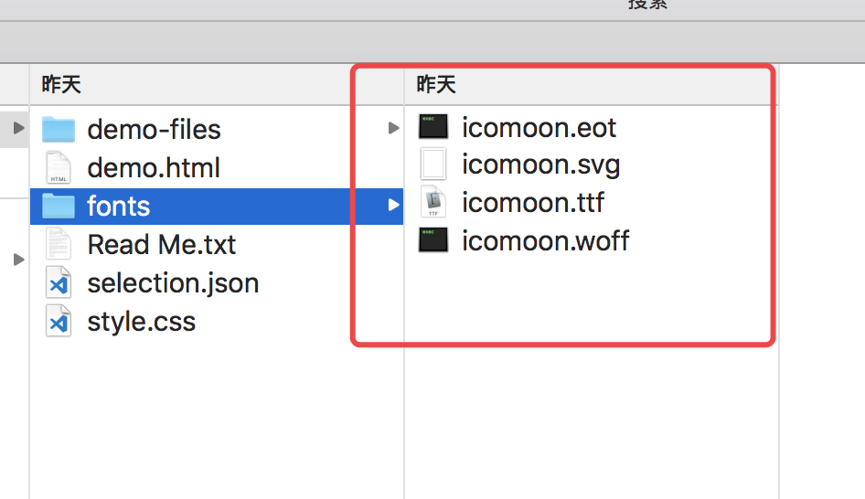
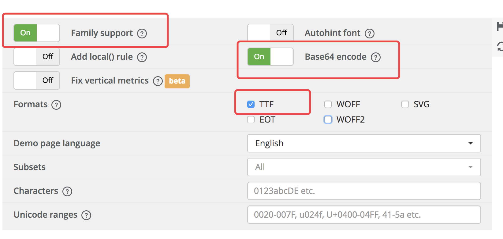
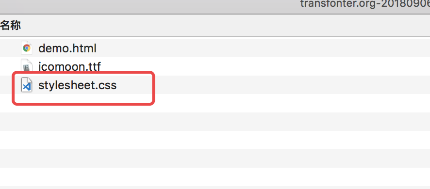
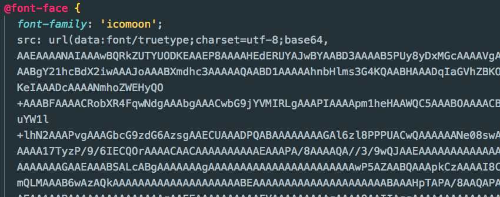

在做项目中难免会遇到需要使用iconfont的时候，在小程序中引入字体的方式和普通项目有所不同。

<!-- more -->

## 原因

在小程序的wxss中，font-face的url不接受http地址，或者相对地址，不过却可以接受base64编码的内容。我们可以把自己生成的字体文件或者UI提供的字体文件转换成base64然后引用。

## 自己生成字体文件

可以在[阿里巴巴字体库](http://www.iconfont.cn/)中自己生成字体文件，然后把压缩包下载下来，具体步骤请自行[谷歌](https://www.google.com/)

解压后找到fonts文件夹，会有这几个文件



## 将字体文件转base64

登陆[这个网站](https://transfonter.org/)，点击Add fonts，上传刚才解压文件中的**.ttf结尾的文件**就行，选中如下图的选项后，点击Convert生成文件，成功之后，点击download下载zip包，解压之后找到其中的css文件，打开，然后将里面的内容复制到app.wxss中，就可以在自己的页面中使用iconfont了

**注意选中几个必要的选项**



这是解压后的文件内容




这是要复制的css，太长了，只截图开头了



```
  记得把@font-face下面的内容也复制进去

  [class^="icon-"], [class*=" icon-"] {}

  .xxx:before{}

  这些都别忘记复制进去
```


