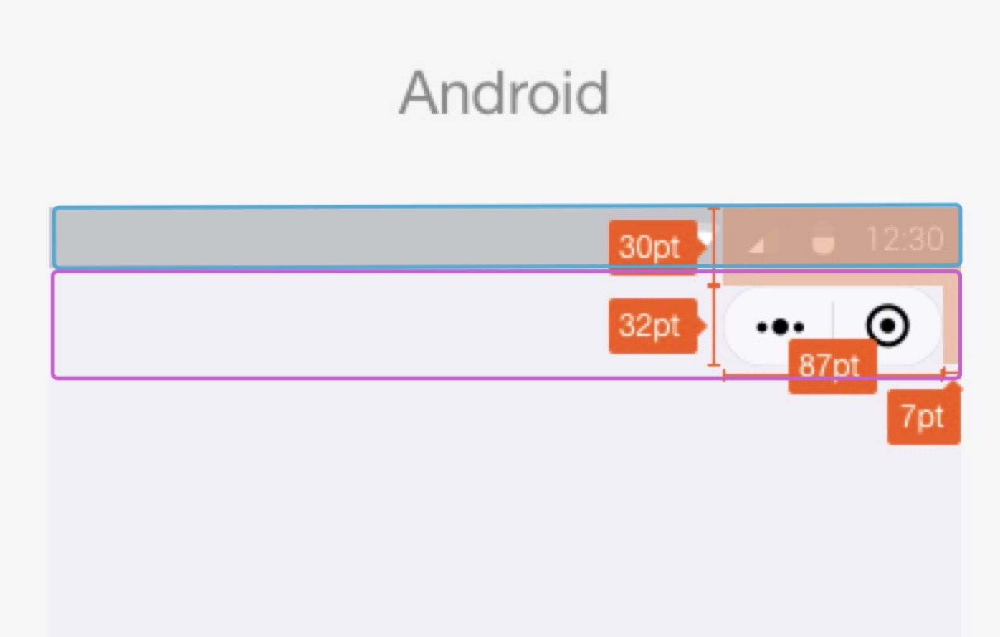
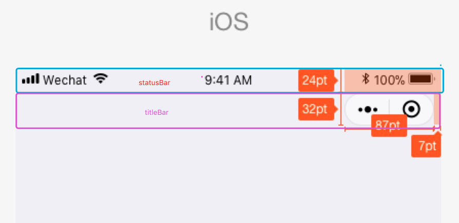
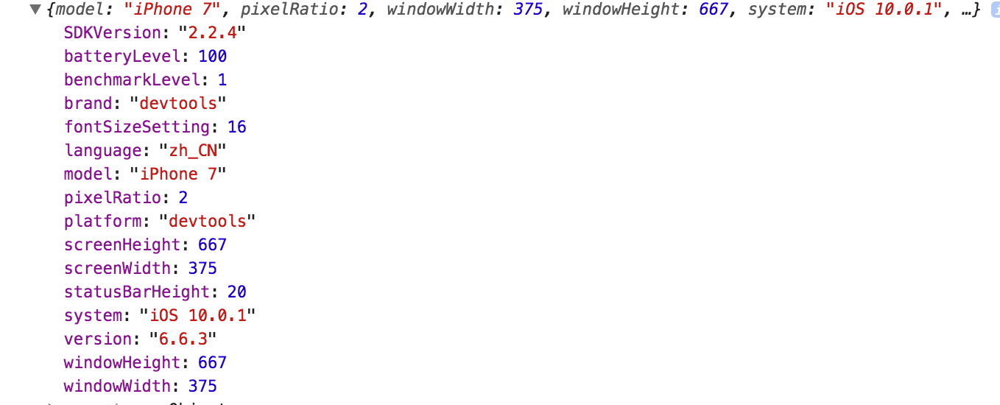
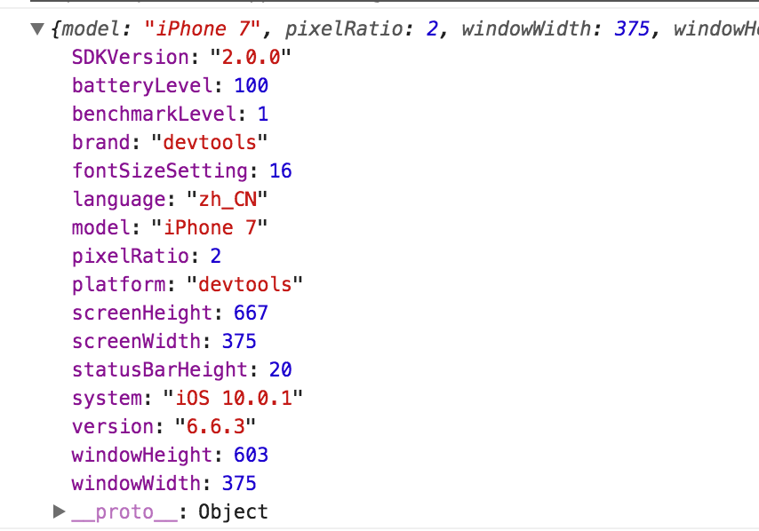
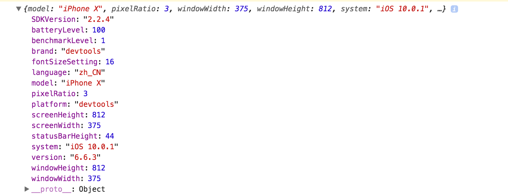
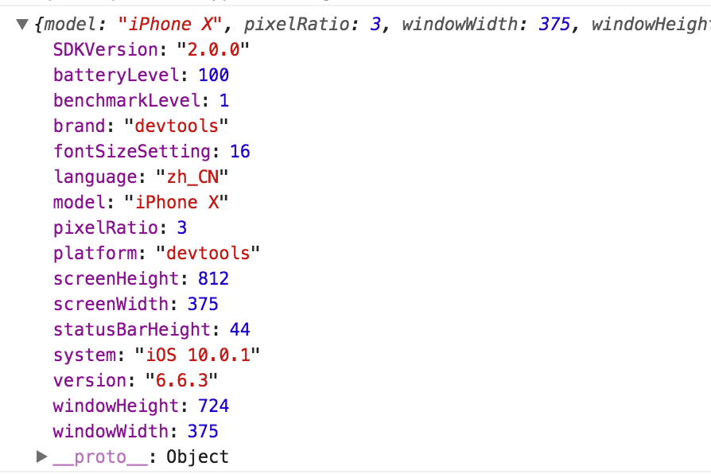
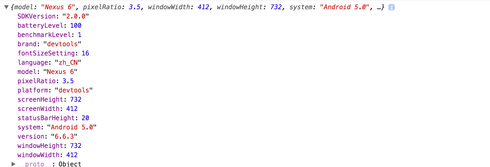
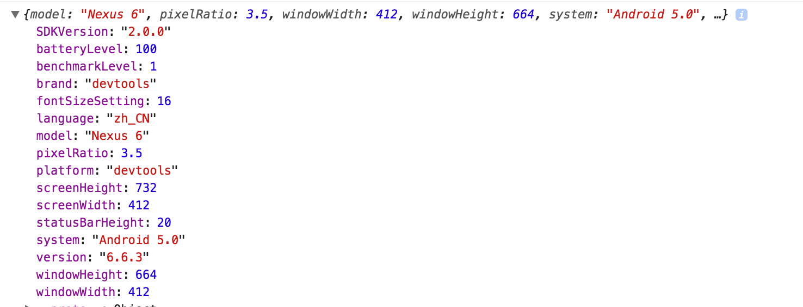

在做小程序项目过程中，可能需要我们自定义头部，以满足项目需求，但是自定义头部在不同手机下的展示，以及自身高度等都不能写死的，那么我们如何来做从而兼容不同手机呢。

<!-- more -->

### 配置使用自定义头

小程序中为我们提供了简洁的配置，只需要在app.json内的window下配置navigationStyle就可以不用系统的自带头部。
如下所示：

```
  "window": {
    "navigationStyle": "custom"
  }

```

### 设置自己的自定义头

个人理解，自定义头部其实由两部分组成，一部分是最上面的状态栏，也就是显示网络、时间的部分，我们称作statusBar，另一部分是我们内容栏组成，成为titleBar里面放icon啊，title啊、自定义头部的样式啊等等

如图：



以及




#### wx.getSystemInfo、wx.getSystemInfoSync

我们要用小程序自带API，来获取系统信息。

[详情请戳这里](https://developers.weixin.qq.com/miniprogram/dev/api/systeminfo.html#wxgetsysteminfoobject)

如图：

iPhone7的custom模式下



iPhone7的非custom模式下



iPhoneX的custom模式下



iPhoneX的非custom模式下



Android的custom模式下



Android的非custom模式下



可以看到，在custom模式下screenHeight是等于windowHeight的，而非custom下screenHeight是不等于windowHeight的

```
  有这么一个公式

  titleBar = screenHeight - windowHeight - statusBarHeight

  要在非custom模式下计算

  在网上搜得了一组数据，不完全统计（ip6 , ip5 , ip6p , ipx , 小米mix2  , 小米5等综合了开发工具提供的数据和真机数据）所得
  以下值是  titleBar + statusBar的值，也就是screenHeight - windowHeight的值
  {
    'iPhone': 64,
    'iPhone X': 88,
    'android': 68
  }

```


#### 不同机型

通过小程序提供的API，我们得到了一些数据，手机系统，状态栏（statuBar）的高度等。
我们可以吧手机类型分为3种。Android、iPhone、iPhoneX，因为iPhoneX齐刘海的缘故，statusBar比较高

处理不同机型

```
  const res = wx.getSystemInfoSync()
  // let totalTopHeightSet = {
  //   'iPhone': 64,
  //   'iPhone X': 88,
  //   'android': 68
  // }
  let totalTopHeight = 68,
      statusBarHeight = res.statusBarHeight;

  if(~res.model.indexOf('iPhone X')) {
    totalTopHeight = 88
  } else if(~res.model.indexOf('iPhone')) {
    totalTopHeight = 64
  }

  // 你自己的处理逻辑xxxxxxxx

  //友情提醒

  记得计算之后要拼接'px',不然放到元素style内不生效

```

这样处理就不用担心不同手机头部的样式问题

#### 参考链接

[点击进入](https://developers.weixin.qq.com/blogdetail?action=get_post_info&lang=zh_CN&token=1535491394&docid=0006c012dc8028f04b070dd0551004)

[点击进入](https://developers.weixin.qq.com/miniprogram/design/image/13titlebar.jpg)